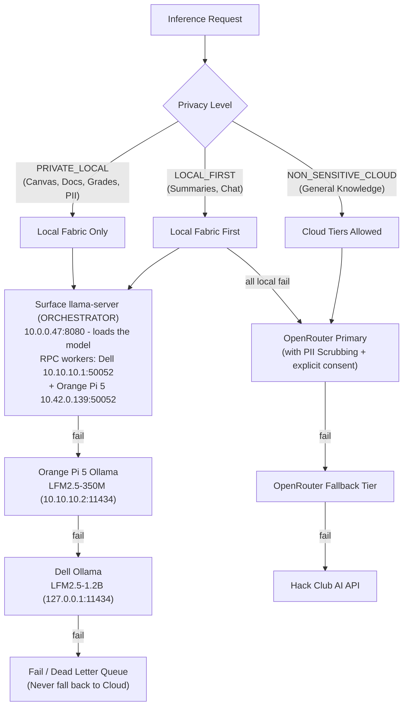

# AI Developer Context — pab-core

> **Audience**: AI Coding Agents (Antigravity, Claude, Codex, Cursor, etc.) and software engineers modifying, maintaining, or debugging the `pab-core` codebase.
> This document establishes the architectural context, system invariants, execution paths, subsystem boundaries, and operational rules required to safely navigate and modify this repository.

---

## 1. System Mission & Core Constraints

`pab-core` is the application tier of a self-hosted, privacy-first personal assistant bot designed for a single owner (a high-school student). It ingests coursework from Canvas, Google Classroom/Docs, and GroupMe, builds periodic digests and study material, answers user queries over chat, and maintains an assignment calendar.

### Cardinal Invariants
1. **Single-Tenant & Owner-Only**: The bot strictly serves the configured `TELEGRAM_OWNER_USER_ID`. Every incoming command, message, callback, and API bridge route must pass through the security perimeter in `bot/security.py`.
2. **Local-First & Privacy Boundary**: All student coursework, grades, personal emails, notes, and school messages are strictly classified as private data. They MUST NEVER be dispatched to public cloud LLMs without explicit classification and sanitization. All logging and external transit must pass through `utils.scrub_pii()`.
3. **Transactional State & Concurrency Safety**: All state persistence (`state.json`, `.nightly_queue.json`, dead-letter queues) must utilize atomic file writes and file locks (`.lock`) via `bot/storage.py` and `bot/state.py` to prevent state corruption during power loss or concurrent execution.
4. **No Direct Database Daemon**: State and knowledge are stored in structured JSON files, vector indices (`.npz`), and markdown/docx files. Do not introduce monolithic SQL/NoSQL database servers.
5. **No Phantom Artifacts in Syncthing**: The `study_guides/` directory is synchronized via Syncthing directly into the user's Obsidian Vault. Never drop temporary files, logs, or intermediate raw caches in `study_guides/`; use `source_cache/`, `cache/`, or `logs/`.

---

## 2. Tri-Repo Ecosystem & Boundaries

The project is split into three decoupled repositories:

```
┌─────────────────────────────────────────────────────────────────────────────┐
│                          pab-core (This Repo)                               │
│  Telegram Bot (main.py), Scrapers, LLM Router, Digest, Calendar, Ingest     │
└──────────────────────┬───────────────────────────────┬──────────────────────┘
                       │                               │
                       ▼                               ▼
┌────────────────────────────────────────┐ ┌──────────────────────────────────┐
│           pab-ops (Infra)              │ │    pab-study-content (Data)      │
│ Systemd units, health checks, timers,  │ │ Generated Markdown/Word study    │
│ multi-node llama.cpp RPC cluster ops   │ │ guides, knowledge base, SAT prep │
└────────────────────────────────────────┘ └──────────────────────────────────┘
```

- **`pab-core` (Public)**: Contains all business logic, scrapers, bot interfaces, AI bridges, and service scripts.
- **`pab-ops` (Public)**: Holds host-level systemd service files, timers, health-check scripts, and distributed RPC cluster management.
- **`pab-study-content` (Private)**: Holds the generated study guides, SAT master guides, and knowledge base notes.

### Sibling clones on this host
- `~/pab-dev` — a **frozen dev clone** of pab-core (last code sync ~2026-08-17, HEAD `fc1b4da`). Its working-tree `README.md`/`AI_CONTEXT.md` are kept as copies of pab-core's; do not treat it as the live repo.
- `~/pab-ops-staging` / `~/pab-study-content-staging` — staging clones of the sibling repos.
- `~/personal-assistant-bot-release` — a **git worktree** sharing pab-core's `.git` object store. Never run history-rewriting commands (`filter-repo`) in pab-core's `.git`; it would desync the worktree. Reachability-preserving `git gc --prune=now` is safe.

---

## 3. Codebase Architecture & File Map

```
.
├── main.py                     # Entry point for bot.service (Telegram long-poll, scheduler)
├── config.py                   # Central configuration & environment variables (Single Source of Truth)
├── llm_router.py               # Unified LLM dispatcher, local/cloud routing, cost tracking
├── ai_processor.py             # Per-source extraction passes, local model summarization
├── utils.py                    # Shared utilities: scrub_pii, atomic file helpers, backups
├── activity_log.py             # Privacy-scrubbed structured activity logging
├── nightly_processor.py        # Overnight lossless document processor & study guide updater
├── practice_grader.py          # Automated SAT/ACT practice test grading logic
├── voice_handler.py            # Local-only voice note transcription (local Whisper engine)
├── inline_keyboards.py         # Telegram UI interactive inline keyboards
│
├── bot/                        # Telegram-Facing Subsystem
│   ├── commands.py             # Slash commands (/start, /summary, /model, /canvas, etc.)
│   ├── ai_bridge.py            # Privacy-preserving chat <-> LLM Router bridge
│   ├── ui.py                   # HTML escaping, message chunking, formatting primitives
│   ├── state.py                # State manager wrapper with in-memory caching & bounded sets
│   ├── storage.py              # Atomic JSON read/write primitives with file-locking
│   ├── security.py             # Access control (strict owner ID verification)
│   ├── runtime.py              # Background task lifecycle tracking
│   ├── smart_router.py         # Heuristic query classifier (PII→local, mode & engine selection)
│   └── dashboard_state.py      # Route state provider for HTTP dashboard
│
├── scrapers/                   # Data Ingestion & Transformation Tier
│   ├── canvas_scraper.py       # Canvas scraper via authenticated Firefox daemon
│   ├── canvas_page_extractor.py# Parses raw Canvas HTML pages into structured tasks
│   ├── onenote_scraper.py      # OneNote Graph API client (OAuth2, page/asset fetch)
│   ├── onenote_web_scraper.py  # Browser-backed OneNote Online scraper (ClassLink profile)
│   ├── onenote_page_extractor.py # OneNote page/ink extraction with vision fallback
│   ├── lfm_vision_harness.py   # LFM2-VL local vision harness for image/ink pages
│   ├── google_scraper.py       # Google Classroom, Docs, Drive, and Gmail ingest
│   ├── composio_fetcher.py     # Composio-based Google data integration
│   ├── groupme_scraper.py      # GroupMe class chat scraper and announcement parser
│   ├── notion_client.py        # Notion workspace integration and task syncer
│   ├── assignment_calendar.py  # CalDAV (Radicale) & Google Calendar synchronization
│   ├── google_docs_calendar.py # Extracts deadlines from Google Docs with approval gates
│   ├── morning_digest.py       # Periodic digest builder (runs every 4 hours)
│   ├── topic_discovery.py      # Per-class study-topic discovery (grounded, deterministic-first)
│   ├── study_providers.py      # Free online provider chain (scrub-then-refuse) for study builds
│   ├── mega_study_builder.py   # Multi-stage textbook & study guide compiler
│   ├── nightly_processor.py    # Lossless leased-queue processor for queued study docs
│   ├── memory_consolidation.py # Curated-brain consolidation with deterministic fallback
│   ├── embedding_indexer.py    # Incremental vector indexing (nomic-embed-text via Ollama)
│   ├── semantic_retrieval.py   # Cosine similarity vector search over embedding index
│   ├── web_precacher.py        # Opt-in, bounded public-web enrichment (private prompts stay local)
│   └── batch_results.py        # Typed validation and status tracking for batch jobs
│
├── surface/                    # Cluster control plane (deployed on the Surface orchestrator)
│   └── cluster_manager.py      # HTTP control surface for node management & model switching
│
├── scripts/                    # Daemons & CLI Tooling Executed by Services (~35 scripts)
│   ├── canvas_browser_daemon.py# Persistent Firefox daemon for ClassLink SSO (port 8976)
│   ├── dashboard_agent.py      # Status dashboard web agent (port 8765)
│   ├── crawl_onenote_pages.py  # OneNote notebook/section/page harvest via browser session
│   └── generate_daily_digest.py# Standalone trigger for digest creation
│
├── tests/                      # pytest test suite (243 unit & integration tests, all passing)
└── docs/                       # Architecture diagrams, runbooks, and historical audits
```

---

## 4. LLM Routing & Privacy Architecture

The `llm_router.py` module governs all inference requests. It applies a multi-tier fallback ladder based on task sensitivity:



### Key AI Routing Rules
- **Never bypass `llm_router`**: Do not call `requests.post` to OpenAI/OpenRouter directly from scrapers or commands.
- **PII Scrubbing**: `utils.scrub_pii()` strips student names, school identifiers, specific URLs, emails, and phone numbers before any outbound cloud dispatch. Scrubbing is defense-in-depth, **not consent** — private data fails closed unless the caller passes `sensitivity=PUBLIC` **and** `cloud_consent=True`.
- **Surface-first chain & timeout budget**: The Surface orchestrator's attempt is capped by `RPC_SURFACE_TIMEOUT` (hard-clamped in `config.py` to stay ≥60 s under `RPC_INFERENCE_TIMEOUT`), so a Surface stall can never consume the shared monotonic deadline needed by the Pi/Dell Ollama fallbacks. The Orange Pi empty-response result is transparently retried once against local Ollama.

---

## 5. Ingestion & Data Flow Details

### 1. Canvas Ingestion via Persistent Browser Session
- Canvas is protected behind ClassLink SSO with MFA. It cannot be accessed via a simple static API token.
- `scripts/canvas_browser_daemon.py` runs as `canvas-browser.service` (port `8976`), maintaining an authenticated Firefox session.
- `canvas_scraper.py` queries `http://127.0.0.1:8976/` to fetch raw HTML pages, which `canvas_page_extractor.py` parses into structured assignments.

### 2. Google Drive / Classroom / Docs
- Google APIs authenticate using OAuth tokens (`token.json` / `credentials.json`).
- Always use `supportsAllDrives=True` and `corpora="allDrives"` on Google Drive API queries to prevent missed classroom files.
- Google Docs deadlines are parsed via `google_docs_calendar.py` and require approval before landing on Google Calendar.

### 3. CalDAV & Assignment Sync
- Local assignments are synced directly to a self-hosted Radicale CalDAV server (`0.0.0.0:5232`).
- `scrapers/assignment_calendar.py` enforces deduplication by assignment title and course code.

### 4. Semantic Vector Retrieval
- `scrapers/embedding_indexer.py` generates 768-dimensional embeddings using `nomic-embed-text` hosted on Ollama.
- Vectors, document chunks, and MD5 hashes are saved to `embedding_data/embedding_index.npz`.
- Indexing is incremental: only modified files are re-embedded.
- At chat query time, `semantic_retrieval.get_context_for_prompt()` extracts the top-$K$ cosine similarity chunks to inject into the LLM context.

---

## 6. Nightly Processing & State Durability

### Scheduled Jobs (America/New_York)
| Job | Schedule | Module |
| :--- | :--- | :--- |
| Watchdog scrape cycle | every 30 minutes | `main.py` (`run_watchdog`) |
| Digest build & delivery | every 4 hours | `main.py` (`check_updates`) |
| Nightly batch cycle | **1:00 AM** | `main.py` (`nightly_wrapper`) |
| Morning digest | 7:00 AM | `main.py` |
| Backups | 3:00 AM daily | `main.py` (`create_backup`) |
| File rotations | every 6 hours | `utils.enforce_all_rotations` |

### Nightly Batch Cycle (1:00 AM ET)
1. Ingests raw queued items from `.nightly_queue.json` (leased before processing, acked only after durable append — crash-safe with 30-minute leases and 5 retries).
2. Runs OCR on new PDF/image classroom attachments (bounded: 25 MB/file, 100 PDF pages).
3. Performs **Delta Updates** to study guides (appends new extracted notes to existing guides in `study_guides/` rather than re-generating 400KB+ files from scratch).
4. Unprocessed or failed items are moved to `.nightly_dead_letter.json` for operator review without dropping data.
5. Rebuilds the semantic embedding index incrementally.

### State & Storage Management
- File: `state.json` tracks `seen_tasks`, `last_digest_time`, `active_topics`, and user preferences.
- Reads/writes MUST go through `bot/storage.py` (`AtomicJSONStore`) or `bot/state.py`.
- `seen_tasks` is a bounded FIFO list capped at **300** entries (`bot/state.py:MAX_SEEN_TASKS`), with legacy hex digests pruned on load. Note: `config.MAX_SEEN_TASKS` (200) is a separate legacy value consumed by `utils.enforce_all_rotations`'s rotation cap — the two are intentionally distinct until that legacy path is retired.

---

## 7. Development, Testing & Modification Rules

### Running Tests
Always run the test suite before submitting or deploying changes:
```bash
source venv/bin/activate
pytest -q
```
Ensure all tests pass and no mocks leave orphan state files.

### Telegram HTML Escaping
All messages sent to Telegram via `bot/ui.py` MUST have dynamic content escaped using `bot.ui.escape_html()` to prevent broken HTML tags from failing Telegram message dispatch.

### Logging Standards
Use `utils.logger` or `activity_log.log_activity()`. Never log raw authorization tokens, student passwords, or unscrubbed PII.

### CI & Git Hooks
- `.github/workflows/lint` mirrors `.githooks/pre-commit` (pyflakes + DeprecationWarning-as-error + static-grep deprecation patterns) and runs on push/PR to `main`.
- `tests/test_script_imports.py` hard-codes the module list — **deleting a script requires updating that test or the suite fails**.
- Validate a fresh-clone import after adding runtime dependencies: `python -c "import main"` must succeed (8 files were once missing from git and only tests-mocked around the gap).

### Commit Hygiene
- **Never `git add -A`** — the working tree carries ~100 legitimately-dirty `academic_notes/` files from live scraping. Stage explicit paths only.

---

## 8. Common Pitfalls & Traps to Avoid

| Pitfall | Consequence | Correct Pattern |
| :--- | :--- | :--- |
| **Direct JSON edits** | Race conditions & corrupted `state.json` | Use `bot.storage.save_json_atomic()` with file locking. |
| **Bypassing Security** | Unauthorized users executing bot commands | Decorate handlers or verify `bot.security.is_owner(update)`. |
| **Temp files in `study_guides/`** | Syncthing syncs temp files into Obsidian | Save temp files strictly in `source_cache/` or `cache/`. |
| **Raw Google Drive queries** | Shared school files omitted from query results | Always specify `supportsAllDrives=True, corpora="allDrives"`. |
| **Unbounded Fallback Waits** | Telegram message timeouts (>60s) | Respect `RPC_INFERENCE_TIMEOUT` and handle fallbacks gracefully. |
| **Unescaped HTML in Telegram** | Telegram API `BadRequest: Can't parse entities` | Always wrap dynamic strings in `bot.ui.escape_html()`. |
| **`git add -A` on this tree** | Commits ~100 dirty scraped `academic_notes/` files | Stage explicit paths only; the dirtiness is expected. |
| **Deleting a script** | `test_script_imports.py` fails on the hard-coded module list | Update the test's module list when removing scripts. |
| **History rewrite in this `.git`** | Desyncs the `personal-assistant-bot-release` worktree sharing the object store | Only `filter-repo` on an isolated clone; reachability-preserving `gc` is safe. |
