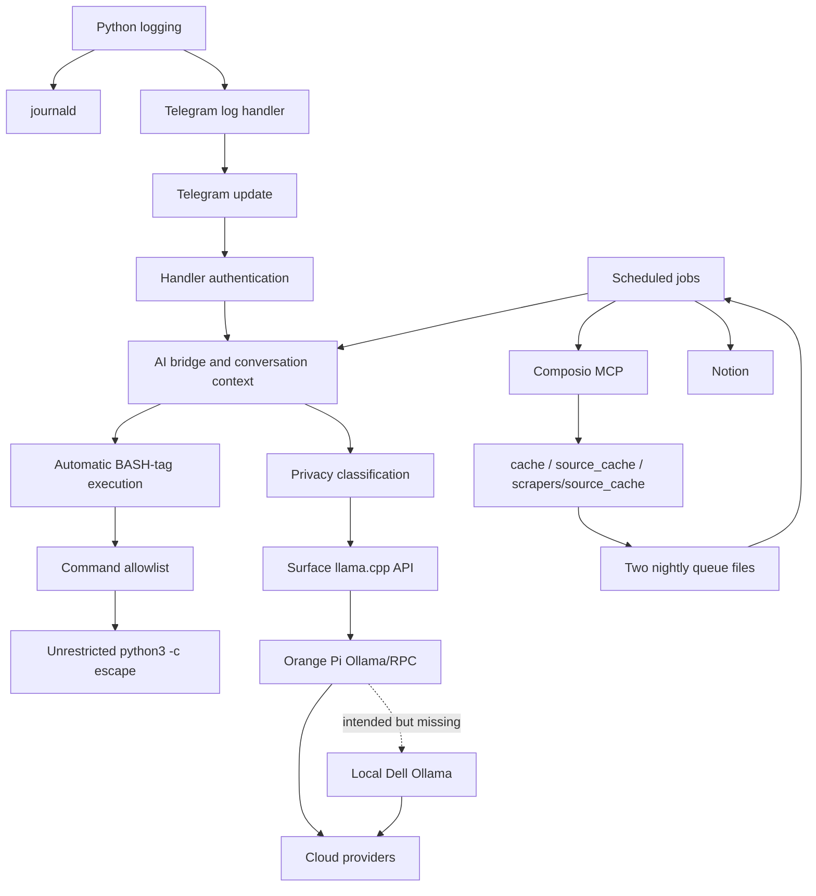

# Consolidated Bug Audit and Remediation Guide

Audit date: 2026-07-21 (live hardware follow-up: 2026-07-22)
Code baseline: `deae8ce9360185a63ce2761776a6724046e24a5b` (`main` and `origin/main`)
Repository: `SanelL112/Antigravity-Based-Assistant-Bot`

Current-code verification: 2026-07-23 at `1afabff0e54750d541fe4faf466ee02ee6171331` (`main`)

## Purpose and scope

This is the repair handoff for the current bot revision. It consolidates the code audit, `journalctl -u bot.service`, local activity/chat histories, the preserved Telegram alert transcript, Hermes MCP logs, the installed systemd units, the live Composio probes, the live Ollama endpoint checks, and the 2026-07-22 Surface/Orange-Pi follow-up probes.

This document is intentionally more conservative than the older audit files in this repository. It distinguishes:

- **Active** — confirmed in the current source, configuration, credential state, or live service behavior.
- **Historical/resolved** — present in older logs but already corrected in the current revision.
- **Deferred** — requires a production topology change, a currently unavailable interface/route, or a controlled restart; the 2026-07-22 read-only hardware probes are recorded separately below.
- **Operational** — not necessarily a code defect, but requires credential, secret, or deployment work.

No bot implementation was changed as part of this audit. The only intended change is this documentation file. Existing generated files and the dirty worktree must be preserved.

The audit found confirmed defects, but it cannot prove that no additional defect exists. Treat this as the confirmed repair backlog for the audited baseline.

## Current code verification — 2026-07-23

The detailed findings and status labels below describe the July 21 baseline. This
section supersedes those labels for the current `main` commit. It is a source and
test review, not proof of live service, credential, or hardware state.

The local regression suite passes (**41 tests**), but it does not cover every
private-data call path or the GitHub Actions workflow.

### Still open or only partially remediated

| IDs | Current status | Evidence and required follow-up |
|---|---|---|
| SEC-01 | **Partial — high risk remains** | Arbitrary `python3 -c` execution is blocked, but the command allowlist accepts unrestricted `<path>` arguments. An allowed read command can still access service-readable secrets or files outside approved roots. Resolve paths and enforce an explicit allowed-root policy. |
| SEC-03 | **Open — critical** | Several private-data paths still allow cloud fallback: `scrapers/web_precacher.py` sends `curated_brain.md` to OpenRouter; `scrapers/compile_context.py`, `scrapers/nightly_indexer.py`, and `scripts/generate_daily_digest.py` omit `allow_cloud=False`. Make private the default and require an explicit public classification for every cloud call. |
| SEC-04 | **Operational action required** | Code reduces future HTTP client noise, but the historical Telegram token exposure still requires rotation, secret-store update, service restart, and journal-retention review. |
| SEC-05 | **Open** | `bot/ai_bridge.py` logs raw user-message excerpts; `main.py` writes raw OCR into chat histories and `important_extracts.txt`; `activity_log.py` persists arbitrary details before notification scrubbing. Replace prompt excerpts with metadata and define retention/permissions. |
| LLM-05 | **Partial / operationally unverified** | The router has safer local fallback behavior, but worker participation and the Surface RPC lifecycle still need a controlled deployment/restart test. |
| MCP-01 | **Operationally open** | Canvas still needs Composio re-authentication. |
| MCP-02, MCP-03 | **Open** | Composio remains hardcoded on in `main.py`; its wrapper has limited SSE/error recovery and native/Composio credential health is not modeled as configuration. |
| LOG-02 | **Partial** | `telegram_logger.py` is queue-backed, but `activity_log.log_event()` still makes a synchronous Telegram HTTP request and can block a caller. |
| LOG-03 | **Partial** | Activity-log timestamp parsing is fixed, but scanning remains root-only rather than covering configured `logs/` roots and does not explicitly classify structured nightly failures. |
| ASYNC-01 | **Partial** | `web_precacher.py` calls synchronous local/cloud inference inside an async function; the nightly wrapper makes a blocking Pi health request; memory consolidation still performs direct process/download work in its async flow. |
| DATA-01 | **Partial** | The canonical cache is `cache/`, but memory consolidation and embedding collection still fall back to `scrapers/source_cache`, which can reintroduce stale inputs. |
| TEST-01 | **Partial** | The tracked `comprehensive_test.py` and `audit_script.py` remain import-side-effect scripts, even though the dedicated `tests/` suite is safe to collect. |
| TEST-02, TEST-03 | **Open** | GitHub Actions does not run pytest. Its import check sets `TELEGRAM_CHAT_ID=0`, which `config.py` rejects, then silently counts the imports as skipped. Run pytest in CI with valid test defaults and fail on unexpected skipped imports. |

### Confirmed code remediations

- **SEC-02:** `/start` is authenticated and uses the configured owner chat.
- **LLM-01 through LLM-04, LLM-06, LLM-07:** explicit Dell/Pi roles, local fallback, health-path alignment, provider argument order, and response validation are corrected in source; live service health remains separate.
- **LOG-01 and LOG-04:** logging setup order and canonical health-report cache path are corrected.
- **ASYNC-02, ASYNC-03, MEDIA-01, MEDIA-02:** job wrappers, lifecycle cleanup, and media-file cleanup are covered by the repair suite.
- **STATE-01, NOTION-01, DATA-02 through DATA-05, DEP-01, DEP-02, UI-01, WARN-01:** the documented code changes are present, including atomic state updates, safe queue acknowledgement, full-content hashing, typed Google download handling, dependency/API updates, and syntax/UI fixes.

### Required live verification

1. Rotate the Telegram bot token, update the secret store, restart the bot, and verify the old token fails.
2. Re-authenticate the Canvas Composio connection.
3. Deploy the current `main` code, then perform a controlled Surface/Pi/Dell cluster participation test.

## Audit evidence snapshot

- Local `main` and GitHub `origin/main` both resolved to the baseline commit above.
- The installed `/etc/systemd/system/bot.service` matched the repository service file.
- `bot.service` was active from the July 20 restart; that restart did not reproduce the older DNS startup crash.
- During the original 2026-07-21 audit, local `ollama.service` and its health timer were active and the local API returned four installed models; the application-configured Pi endpoint timed out.
- In the 2026-07-22 follow-up, the local Dell `ollama.service` was failed/start-limit-hit with no local listener, while Pi Ollama returned HTTP 200 and exposed `nomic-embed-text` and the configured Qwen model. This is a changed live state and does not invalidate the historical log finding.
- Read-only Composio probes succeeded for Gmail, Classroom, and Drive; Canvas alone returned an expired connected-account token.
- All 63 Python files parsed. Two `SyntaxWarning`s remain and are listed as WARN-01.
- Root `nightly_queue.json` contained 280 rows/63 unique IDs; the queue read by `scrapers/nightly_processor.py` was empty.
- Current `cache/` files were updated July 21, while important consumers still read July 1 or older legacy cache trees.
- Safe pytest collection was not possible because test-named scratch files perform live requests during import.
- Surface and Orange Pi were subsequently reachable for read-only checks. Surface `/health`, `/v1/models`, and a chat completion returned HTTP 200; Pi Ollama `/api/tags` and a generation request returned HTTP 200; both RPC worker services were active. Distributed RPC was not confirmed because the running Surface server had no `--rpc` argument and the Surface could not route to Pi.

## Live hardware follow-up (2026-07-22)

This section supersedes only the hardware-dependent “offline” note above. No bot, systemd unit, or remote machine was modified.

### Observed addresses and routes

| Node | Interface/address observed | Relevant service |
|---|---|---|
| Dell running the bot | `enp12s0: 10.10.10.1/24`; `wlp2s0: 10.0.0.61/24` | local `ggml-rpc-server` on `0.0.0.0:50052` |
| Surface Pro | `wlp1s0: 10.0.0.47/24` | `llama-web.service` on `0.0.0.0:8080` |
| Orange Pi 5 | `end1: 10.10.10.2/24` | `llama-rpc.service` on `0.0.0.0:50052`; Ollama on `*:11434` |

The proposed `10.0.42.1` and `10.0.42.2` addresses were also probed. Neither host has that address or a connected route; both probes timed out. The currently connected RPC link is `10.10.10.1–10.10.10.2`. The Surface has no `10.10.10.0/24` or `10.0.42.0/24` interface/route. Its unit’s ignored `ExecStartPre` attempts to add `10.10.10.0/24 via 10.42.0.139 dev usb0`, but no `usb0`/`10.42.0.139` interface was present.

### RPC results

- Surface `/health`: HTTP 200, `{"status":"ok"}`.
- Surface `/v1/models`: HTTP 200; the expected 7B GGUF was loaded.
- Surface chat completion: HTTP 200 and valid content (`SURFACE_RPC_OK`). This proves solo Surface inference only.
- Surface process command: `llama-server ... -m ... -c 4096 --host 0.0.0.0 --port 8080`; no `--rpc` argument was present.
- Surface could reach Dell’s Wi-Fi worker address `10.0.0.61:50052` but could not reach Pi `10.10.10.2:50052` or `10.42.0.139:50052`.
- Dell and Pi both had active `ggml-rpc-server` services listening on port 50052. TCP reachability from Dell to Pi succeeded.
- `llama-server --help` confirms this build accepts a comma-separated `--rpc host:port,...` list; the launch script’s list syntax is not the observed failure.
- The launch script detects workers only once at service start. Surface started before the workers were reachable and remained in solo mode; `Restart=always` does not re-run detection while the server process remains healthy.

### Ollama and application-path results

- Pi `GET /api/tags`: HTTP 200 with both required models; Pi generation: HTTP 200.
- Bot configuration resolves both `OLLAMA_URL` and `OLLAMA_ORANGEPI_URL` to `http://10.10.10.2:11434`.
- The bot’s health functions reported `configured_ollama_health=True`, `orangepi_ollama_health=True`, and `local_ollama_health=False` for `http://127.0.0.1:11434`.
- `check_rpc_memory_ok()` returned `(True, "Surface: 2464MB, Dell(worker): 4055MB, Pi(worker): 3624MB")`. This is an observability/memory result, not proof that Surface has an active RPC worker connection.

### What remains deferred

- Do not claim distributed inference until the Surface service is launched with an explicit, reachable worker list and its logs show RPC connections.
- Decide and document the intended subnet/address mapping (`10.10.10.1–2` is the live wired pair; `10.0.42.1–2` is currently absent) before changing endpoint constants or routes.
- Test Pi participation after a controlled service restart or equivalent isolated staging launch; do not restart production services as part of this documentation-only audit.

## Immediate risk summary (historical baseline)

The highest-risk issues are:

1. The command guard allows arbitrary Python through `python3 -c`, while the AI prompt actively teaches the model to use that route. This defeats the command allowlist.
2. `/start` is not authenticated and lets any Telegram caller schedule private scraping and digest jobs to their chat.
3. private school, email, conversation, OCR, and curated-memory content can reach cloud providers after local inference fails.
4. historical journald entries contain the Telegram bot token inside Bot API request URLs. The token must be considered compromised and rotated during remediation.
5. Ollama roles are conflated: most bot inference targets the Pi, `call_local_rpc()` has no Dell fallback, and health scripts test a different endpoint. The live node state can reverse without the router or health report representing it correctly.
6. Canvas is currently unavailable through Composio because that connected account reports an expired access token.
7. journald is missing most normal application logs, while warning logs are synchronously forwarded to Telegram and can create alert storms.
8. three incompatible cache trees and two incompatible nightly-queue locations cause fresh data to be written in one place and stale or empty data to be consumed elsewhere.

## Backlog index (historical baseline)

| ID | Severity | Audit status | Short description |
|---|---|---|---|
| SEC-01 | Critical | Active | `python3 -c` defeats the command allowlist |
| SEC-02 | Critical | Active | unauthenticated `/start` schedules private jobs |
| SEC-03 | Critical | Active | private inputs can fall through to cloud |
| SEC-04 | Critical | Operational | Telegram token exposed in historical journals |
| SEC-05 | High | Active | raw private context retained/logged too broadly |
| LLM-01 | High | Active | general Ollama URL points to Pi |
| LLM-02 | High | Active | `call_local_rpc()` never tries Dell Ollama |
| LLM-03 | High | Active | semantic retrieval starts local but probes remote |
| LLM-04 | High | Active | health checks test a different inference endpoint |
| LLM-05 | High | Active | unsafe RPC lifecycle and topology drift |
| LLM-06 | High | Active | cross-provider fallback arguments reversed |
| LLM-07 | Medium | Active/log-confirmed | sanity checker rejects valid short answers |
| MCP-01 | High | Operational | Canvas connected account expired |
| MCP-02 | High | Active | MCP errors are weakly handled and become data |
| MCP-03 | Medium | Active | mixed auth modes create false health alarms |
| MCP-04 | Informational | Recovered | Hermes MCP reconnect events |
| LOG-01 | High | Active | logging setup suppresses normal journald output |
| LOG-02 | High | Active/log-confirmed | synchronous, silent, noisy Telegram logger |
| LOG-03 | Medium | Active | scanner misdates and misses logs |
| LOG-04 | Medium | Active | health report reads stale paths |
| ASYNC-01 | High | Active | blocking work remains on the event loop |
| ASYNC-02 | High | Active | JobQueue receives non-awaitable lambdas |
| ASYNC-03 | High | Active/journal-confirmed | async client close is not awaited |
| MEDIA-01 | High | Active | photo handler unbound variable/file leaks |
| MEDIA-02 | Medium | Active | voice file leak/blocking transcription |
| HANDLER-01 | Medium | Active | broad/misleading handler error paths |
| STATE-01 | High | Active | state updates are not transactional |
| NOTION-01 | High | Active | failed tasks are marked seen/reported successful |
| DATA-01 | High | Active | three divergent cache trees |
| DATA-02 | High | Active | split queue plus destructive clearing |
| DATA-03 | Medium | Active | hashes cover only first 1,000 characters |
| DATA-04 | High | Active | nightly entry point runs twice and kills services |
| DATA-05 | Medium | Active | transient and permanent download errors conflated |
| DEP-01 | Medium | Active/journal-confirmed | deprecated/removed external APIs |
| DEP-02 | Medium | Active | duplicate unpinned requirements |
| UI-01 | Low | Active | literal replacement characters in UI |
| WARN-01 | Low | Active | two invalid escape warnings |
| TEST-01 | High | Active | test collection performs live actions |
| TEST-02 | High | Active | CI import/deprecation check skips failures |
| TEST-03 | High | Active | CI runs no deterministic test suite |

## How the defects relate



The most important chains are:

- **Command chain:** cloud/local model output → BASH tag parser → `run_bash_safely()` → `python3 -c` → unrestricted file/process/network actions.
- **Privacy chain:** private input → Surface/Pi unavailable → Dell fallback skipped because of endpoint configuration → cloud fallback → policy violation.
- **False-health chain:** health script checks `localhost:11434` while the bot calls `10.10.10.2:11434` → either endpoint can fail while the other is reported healthy. The July 21 and July 22 snapshots demonstrated both sides of this mismatch.
- **Data-staleness chain:** scrapers write `cache/` → consolidation/indexing reads older `scrapers/source_cache/` → stale memory and embeddings → lower-quality answers and repeated work.
- **Observability chain:** Telegram handler is installed before `basicConfig()` → no normal stream handler → journald is mostly blind → warnings are sent to Telegram synchronously → noisy alerts with no durable matching record.
- **Task-loss chain:** a task is marked seen before Notion confirms insertion, while state updates are not transactional → failed insertions can be permanently suppressed.

## Required repair order

Do not repair these in arbitrary order. Later work relies on earlier containment.

1. **Contain security exposure**
   - rotate the Telegram token after logging is redacted;
   - remove arbitrary `python3 -c` execution;
   - authenticate `/start` and make authorization fail closed;
   - make private-data routing fail closed with cloud disabled.
2. **Unify provider routing**
   - define distinct Surface, Pi, and local-Dell endpoints;
   - make all callers use one router and one health model;
   - add a real local-Dell fallback.
3. **Restore observability**
   - fix logging initialization;
   - make Telegram alerting asynchronous, rate-limited, and status-aware;
   - fix the log scanner before relying on it for regression testing.
4. **Unify data and state**
   - migrate to one cache tree and one queue;
   - make queue acknowledgements lossless;
   - make state and Notion updates transactional/idempotent.
5. **Fix handler and async correctness**
   - scheduled callbacks, blocking calls, temporary files, shutdown cleanup, and fallback argument ordering.
6. **Repair tests and CI**
   - quarantine live scripts;
   - build deterministic unit/integration coverage around the security and routing invariants.
7. **Run hardware tests**
   - complete the remaining controlled-start, worker-participation, and partition tests after the RPC subnet and routes are corrected.

---

# Detailed findings and fixes

## P0 — Security and privacy

### SEC-01 — Command allowlist bypass through `python3 -c`

**Status:** Active<br>
**Severity:** Critical

**Evidence**

- [`utils.py`](./utils.py#L88-L170) permits `("python3", ["-c", "<code>"])`.
- The Python-specific blocklist starts in [`utils.py`](./utils.py#L172-L190), but blocking a few strings cannot safely constrain Python.
- Validation accepted payloads using alternatives such as `subprocess.run(...)` and `pathlib.Path.unlink(...)`. No destructive payload was executed during the audit.
- [`bot/ai_bridge.py`](./bot/ai_bridge.py#L143-L177) explicitly gives the model `python3 -c` examples for subprocesses, file writes, Notion mutations, and service actions.
- Model-produced BASH tags are executed automatically in [`bot/ai_bridge.py`](./bot/ai_bridge.py#L573-L586).

**Impact**

An authenticated chat, prompt injection in retrieved/scraped content, or compromised model response can escape the intended read-only command set and perform arbitrary actions as the `bot.service` user. The system prompt says commands run “as root,” which is inaccurate, but the service user still owns the repository, credentials, histories, and many personal files.

**Repair**

1. Remove generic `python3 -c` from the command templates immediately.
2. Replace text commands with typed operations, for example:
   - `get_system_memory()`
   - `read_allowed_file(relative_path)`
   - `get_minecraft_status()`
   - `create_notion_task(validated_task)`
3. Keep command construction inside trusted Python code; the model should select an operation and supply schema-validated arguments.
4. Resolve every file path with `Path.resolve()` and enforce containment within explicitly allowed roots.
5. Do not use `shell=True`, shell pipelines, redirection, command substitution, or environment-controlled executables.
6. If a narrow Python diagnostic is absolutely required, expose it as a prewritten script with fixed arguments. Do not attempt to secure arbitrary Python with an AST/blocklist.
7. Require an explicit per-action authorization policy for writes, service control, Git operations, and external API mutations.
8. Audit-log the operation ID, actor/chat, validated arguments, result, and policy decision without secrets or private content.

**Tests**

- Reject `os`, `subprocess`, `pathlib`, `shutil`, `builtins`, `importlib`, `__import__`, `eval`, `exec`, `open`, encoded payloads, attribute traversal, and indirect imports.
- Reject path traversal, symlink escapes, `/proc`, `/sys`, `/dev`, and paths outside approved roots.
- Verify every allowed operation with positive and negative schema tests.
- Feed malicious BASH tags through the complete AI-response parser and prove that no arbitrary process or file mutation occurs.

### SEC-02 — `/start` is unauthenticated and schedules private jobs

**Status:** Active<br>
**Severity:** Critical

**Evidence**

- [`main.py`](./main.py#L474-L488) defines `start()` without `@require_auth`.
- It uses the caller's chat ID to schedule periodic private-source scraping.
- The handler is registered directly in [`main.py`](./main.py#L947-L949).
- [`bot/security.py`](./bot/security.py#L20-L40) also fails open when an update exists but no chat ID can be resolved.

**Impact**

Any Telegram user who can reach the bot can enable Canvas/Gmail/Classroom/GroupMe digest delivery to their own chat. This is both an authorization and data-exfiltration issue.

**Repair**

1. Add `@require_auth` to `start()`.
2. Change `require_auth` to deny when `update` is present and the chat/user identity cannot be resolved.
3. Decide whether authorization is based on `effective_user.id`, `effective_chat.id`, or both; document the rule and use it consistently.
4. Never derive the destination of private scheduled jobs from an untrusted caller. Use the configured owner chat ID after authorization.
5. Add a global unknown-command handler that gives no private system information to unauthorized users.
6. Consider disabling group chats entirely unless explicitly allowlisted.

**Tests**

- Authorized private chat can call `/start`.
- Unauthorized private chat and group chat cannot create jobs.
- Missing/partial update objects fail closed.
- Repeated `/start` calls do not remove or replace another chat's jobs.

### SEC-03 — Private data can fall through to cloud providers

**Status:** Active<br>
**Severity:** Critical

**Evidence**

- [`llm_router.py`](./llm_router.py#L986-L1086) sends RPC failures to Ollama and then OpenRouter unless `skip_cloud_fallback=True`.
- [`main.py`](./main.py#L797-L825) sends `curated_brain.md` content into that fallback chain without disabling cloud.
- [`bot/ai_bridge.py`](./bot/ai_bridge.py#L89-L133) routes detected PII to Pi models, but if they fail it continues into the cloud path with scrubbed text.
- The final cloud prompt also contains scrubbed system memory, digest, and conversation history in [`bot/ai_bridge.py`](./bot/ai_bridge.py#L276-L297).
- [`main.py`](./main.py#L238-L266) may send school/email watchdog data to OpenRouter.
- [`main.py`](./main.py#L676-L704) may send photo OCR to OpenRouter.

**Why scrubbing is insufficient**

Regex scrubbing can remove obvious names, emails, and numbers but cannot reliably remove grades, assignments, school relationships, medical context, unique events, or identity inferred from context. The project's stated policy is that private data stays local, not merely that obvious identifiers are replaced.

**Repair**

1. Introduce an explicit routing policy object rather than a boolean inferred inside providers:

   ```text
   data_class: PUBLIC | ACADEMIC_PUBLIC | PRIVATE
   allowed_targets: SURFACE | PI | DELL | CLOUD
   allow_cloud: true/false
   ```

2. Make `PRIVATE` fail closed: local failure returns a private-safe “local service unavailable” response and never invokes a cloud adapter.
3. Set `allow_cloud=False` for:
   - curated brain and memory consolidation;
   - chat history;
   - email, Canvas, Classroom, GroupMe, Notion, and calendar content;
   - OCR/photos and voice transcripts;
   - semantic retrieval over personal documents.
4. Require each cloud call site to pass a non-private classification explicitly. Default to private when classification is missing or fails.
5. Remove provider-owned fallback decisions. The central router should choose providers after evaluating policy.
6. Log only classification and target, not private prompt excerpts.

**Tests**

- Mock Surface, Pi, and Dell as unavailable and assert that the cloud adapter is never called for every private workload above.
- Make the privacy classifier throw, time out, or return malformed output; verify fail-closed behavior.
- Test indirect identifiers and private context, not only SSNs/emails.
- Add a CI test that searches private call sites for an explicit no-cloud policy.

### SEC-04 — Telegram bot token appears in historical journald

**Status:** Operational and active secret risk<br>
**Severity:** Critical

**Evidence**

Historical `httpx` INFO entries include full Telegram Bot API URLs. Telegram embeds the bot token in the URL path. The token is intentionally not reproduced here.

**Impact**

Anyone with access to the relevant journal entries may be able to control the bot until the token is rotated.

**Repair**

1. First prevent future exposure:
   - set `httpx`, `httpcore`, and Telegram request loggers to `WARNING` or above;
   - add a logging filter that redacts `/bot<token>/`, `Authorization`, API keys, query credentials, and cookies;
   - never log constructed Bot API URLs.
2. Rotate the Telegram token through BotFather.
3. update the secret store/`.env`, restart the bot, and verify the old token is rejected.
4. Review journal retention and access membership. Purge or vacuum affected historical journals only after deciding what forensic evidence must be retained.
5. Search other logs, shell histories, paste files, CI artifacts, and backups for the old token without printing it.

**Tests**

- Send a Telegram message with request logging enabled in a test environment and assert that no token-shaped value reaches captured logs.
- Add a secret scanner to CI and pre-commit, with test fixtures explicitly excluded.

### SEC-05 — Raw private context is retained and logged too broadly

**Status:** Active<br>
**Severity:** High

**Evidence**

- [`bot/ai_bridge.py`](./bot/ai_bridge.py#L486-L501) logs the first part of raw user messages.
- [`bot/ai_bridge.py`](./bot/ai_bridge.py#L642-L650) appends raw user/model turns to plaintext topic history.
- Photo OCR is appended to history and `important_extracts.txt` in [`main.py`](./main.py#L714-L740).
- Activity/log formatters may serialize arbitrary detail dictionaries.

**Repair**

- Log event metadata (`chat`, route, duration, byte count, result code) instead of prompt excerpts.
- Apply restrictive file permissions and retention/rotation to histories.
- Separate durable user memory from diagnostic logs.
- Redact or encrypt backups containing personal histories.
- Make deletion/retention behavior explicit and testable.

---

## P1 — RPC, Ollama, and model routing

### LLM-01 — Configured Ollama endpoint points to the Pi, not local Ollama

**Status:** Active and live-confirmed<br>
**Severity:** High

**Evidence**

- [`config.py`](./config.py#L43-L44) defines default and Pi URLs, but the runtime `.env` sets the general `OLLAMA_URL` to the Pi address.
- With no separate override, `OLLAMA_URL` and `OLLAMA_ORANGEPI_URL` resolve to the same Pi endpoint.
- On 2026-07-21, `http://localhost:11434/api/tags` succeeded and listed four models, while the configured Pi endpoint timed out.
- `ollama.service` and its health timer were active and healthy locally.
- [`llm_router.py`](./llm_router.py#L511-L516) only retries from Pi to “default” when the two URLs differ. They currently do not.
- Live follow-up (2026-07-22): the Pi endpoint returned HTTP 200, but the Dell `ollama.service` was failed/start-limit-hit and `127.0.0.1:11434` refused connections. The endpoint-role collision remains a defect even though the Pi is currently online.

**Impact**

The healthy local Dell Ollama is unused by most inference, embedding, and semantic retrieval. When the Surface and Pi are down, calls skip directly toward cloud or fail.

**Repair**

1. Replace ambiguous names with explicit roles:
   - `OLLAMA_LOCAL_URL=http://127.0.0.1:11434`
   - `OLLAMA_PI_URL=http://10.10.10.2:11434`
   - `LLAMACPP_SURFACE_URL=http://10.0.0.47:8080`
2. Fail startup validation if two role endpoints unexpectedly resolve to the same URL.
3. Pass a target enum/endpoint into providers; do not infer hardware from model-name prefixes.
4. Provide one source of truth used by inference, embeddings, semantic retrieval, and health checks.
5. Document the intended fallback order. A reasonable private chain is Surface cluster → Pi Ollama → local Dell Ollama → fail closed.

**Tests**

- Endpoint matrix with each target healthy, unavailable, slow, non-200, malformed, and empty-200.
- Assert local Dell is reached when Surface/Pi are unavailable.
- Assert private requests never continue to cloud.

### LLM-02 — `call_local_rpc()` has no Dell fallback

**Status:** Active<br>
**Severity:** High

**Evidence**

- [`llm_router.py`](./llm_router.py#L657-L723) tries only the Surface API and Pi Ollama.
- Its “all local paths exhausted” message is misleading because local Dell Ollama was never attempted.
- The July 18 Telegram transcript repeatedly showed Pi timeouts followed by “all local paths exhausted” even though the health report showed local Ollama active with four models.

**Repair**

- Delete the duplicate provider logic from `call_local_rpc()` and delegate to the central router.
- Add local Dell as an explicit provider with its own connect/read timeouts and model availability check.
- Cache endpoint health briefly, but do not treat one failed inference as permanent.
- Use a circuit breaker so an offline node is not retried for every chunk.
- Record structured attempt results: target, elapsed time, HTTP status/error class, and fallback reason.

### LLM-03 — Semantic retrieval starts local Ollama but probes the remote endpoint

**Status:** Active<br>
**Severity:** High

**Evidence**

- [`scrapers/semantic_retrieval.py`](./scrapers/semantic_retrieval.py#L88-L115) gets its endpoint from the general `OLLAMA_URL`.
- When unavailable, it launches `ollama serve` locally in [`scrapers/semantic_retrieval.py`](./scrapers/semantic_retrieval.py#L122-L163).
- It then keeps checking the configured remote Pi URL, so a successful local launch cannot satisfy readiness.
- [`scrapers/embedding_indexer.py`](./scrapers/embedding_indexer.py#L275-L285) also calls the configured endpoint but reports that “localhost” is down, even when it actually tested the Pi.

**Repair**

- Do not spawn `ollama serve` from request code on a systemd-managed host.
- Ask the local service manager/health abstraction for local readiness.
- Make semantic retrieval target local Dell explicitly.
- If the embedding service is down, return a bounded lexical fallback and schedule one recovery attempt outside the user request.
- Close the shared semantic-retrieval client during application shutdown.

### LLM-04 — Health checks report the wrong inference path

**Status:** Active<br>
**Severity:** High

**Evidence**

- [`scripts/ollama-health-check.sh`](./scripts/ollama-health-check.sh#L9-L40) checks `localhost`.
- [`scripts/bot-health-check.sh`](./scripts/bot-health-check.sh#L46-L49) also counts local models.
- The application is configured to use the Pi for `OLLAMA_URL`.
- The report can therefore say “Ollama active” while bot inference is timing out.

**Repair**

Report each role separately:

- local Dell Ollama service/API/model status;
- Pi reachability/API/model status;
- Surface llama.cpp `/health`;
- RPC worker reachability;
- effective router decision for private and public test requests.

The health check must import or consume the same resolved configuration as the application. It should never maintain independent hardcoded endpoints.

### LLM-05 — Unsafe RPC lifecycle and drifting topology/configuration

**Status:** Active<br>
**Severity:** High

**Evidence**

- [`llm_router.py`](./llm_router.py#L880-L893) stops RPC with `pkill -f llama-server`. Ollama itself runs a child named `llama-server`, so this can terminate the wrong process.
- [`llm_router.py`](./llm_router.py#L729-L733) defaults to a glob containing model names under Ollama's hash-only blob directory, which may never match.
- Comments/defaults disagree about Surface, Dell, and Pi RPC addresses.
- `call_llamacpp_rpc_with_fallback()` accepts a `timeout` but uses configured constants/fixed fallback timeouts instead of honoring it consistently.
- Response-schema errors are caught as generic “Surface unreachable,” hiding malformed or model-level failures.
- Live follow-up (2026-07-22): both Dell and Pi `llama-rpc.service` units were active, but Surface `llama-web.service` was running without `--rpc`. The Surface launch script performs one-time ping-based worker discovery; it can start successfully in solo mode before workers appear and never re-evaluate them. The Surface could reach Dell at `10.0.0.61:50052` but had no route to Pi’s `10.10.10.2:50052` or the absent `10.42.0.139` address.
- The Surface unit’s ignored route command references `dev usb0` and `10.42.0.139`, neither of which was present in the live interface map. The code comments, `.env`, service units, and live topology therefore describe different networks.

**Repair**

- Manage RPC with a dedicated systemd unit and PID/cgroup, never pattern-wide `pkill`.
- Give each node and port one config key and validate topology at startup.
- Point RPC startup at a real, explicit GGUF path and verify architecture/quantization before launch.
- Separate transport errors, timeouts, non-200 responses, JSON/schema errors, short output, and OOM.
- Honor caller time budgets as a total deadline propagated across attempts.
- Never execute start/stop lifecycle helpers from chat without a separately authorized typed operation.

### LLM-06 — Opencode and Hack Club fallbacks reverse prompt/model arguments

**Status:** Active<br>
**Severity:** High

**Evidence**

- [`bot/ai_bridge.py`](./bot/ai_bridge.py#L383-L400) calls `call_opencode("hy3-free", full_prompt, ...)` and `call_hackclub("qwen/qwen3-32b", full_prompt, ...)`.
- The same reversal occurs in the exception fallback at [`bot/ai_bridge.py`](./bot/ai_bridge.py#L442-L458).
- Provider signatures take `prompt` first and `model` second.

**Impact**

Cross-provider fallback sends the model ID as the prompt and the full prompt as the model name, making the fallback reliably fail or return provider validation errors.

**Repair**

- Use keyword-only provider APIs: `call_opencode(prompt=..., model=...)`.
- Make `prompt`, `model`, privacy policy, timeout, and task explicit keyword-only parameters across every provider.
- Replace hand-written fallback blocks with one central loop over typed provider attempts.

**Tests**

- Mock each provider and assert exact keyword arguments.
- Exercise both the empty-response branch and exception branch.

### LLM-07 — Response sanity checking rejects valid short answers

**Status:** Active and log-confirmed<br>
**Severity:** Medium

**Evidence**

- [`bot/ai_bridge.py`](./bot/ai_bridge.py#L505-L567) treats every answer shorter than 20 characters as suspicious.
- It uses substring checks such as `"no"`/`"yes"` on another model's response rather than a structured result.
- July 20 chat logs contain a valid-response false positive that ended in a recovery-agent timeout message.

**Repair**

- Do not judge correctness from length alone.
- Use deterministic checks only for true protocol violations: empty response, invalid JSON when JSON is required, provider error envelope, or known leaked control tokens.
- If model-based review remains, request strict JSON (`{"valid": true, "reason": ...}`), parse it, and preserve the original answer when review fails.
- Never replace a valid answer with a worse timeout merely because the reviewer is unavailable.

---

## P1 — MCP, Composio, and source authentication

### MCP-01 — Canvas Composio connection is expired

**Status:** Active operational failure<br>
**Severity:** High

**Evidence**

A sanitized read-only probe on 2026-07-21 showed:

- Gmail: success;
- Google Classroom: success;
- Google Drive: success;
- Canvas: `Expired access token`, with expiry `2026-07-18T00:00:00Z`.

This is a Canvas connected-account credential failure, not a total MCP transport outage.

**Repair**

1. Reauthorize or repair the Canvas connection/entity in Composio.
2. Verify `CANVAS_GET_CURRENT_USER`, course listing, assignments, announcements, and pages.
3. Add per-application credential health instead of one “MCP up” flag.
4. Alert once when authorization requires human action; do not retry authentication failures every cycle.
5. Keep credential refresh/re-auth outside normal scraping logic and never log token contents.

### MCP-02 — Raw MCP wrapper has weak recovery and turns failures into data

**Status:** Active<br>
**Severity:** High

**Evidence**

- [`scrapers/composio_fetcher.py`](./scrapers/composio_fetcher.py#L49-L104) implements a one-shot raw HTTPS/JSON-RPC/SSE parser with no transport retry, session negotiation, typed errors, or `finally` cleanup.
- It returns `{"successful": false, ...}` for errors.
- Public scraper functions turn that into ordinary strings such as “Canvas data unavailable” in [`scrapers/composio_fetcher.py`](./scrapers/composio_fetcher.py#L355-L371).
- `main.py`'s `_safe_scrape()` only recognizes raised exceptions, so these strings are passed onward as apparently valid source material.
- Per-course Canvas subcall failures are mostly ignored, which can produce a misleading “No Canvas data” result.

**Repair**

- Prefer the maintained MCP client used by Hermes, or implement the complete streamable-HTTP lifecycle rather than a partial SSE parser.
- Return a typed result:

  ```text
  ScrapeResult(status=OK|EMPTY|TRANSIENT_ERROR|AUTH_REQUIRED,
               data=...,
               source=...,
               retry_after=...)
  ```

- Retry only idempotent transient failures with bounded exponential backoff and jitter.
- Do not retry expired/revoked credentials.
- Ensure connection cleanup in `finally`.
- Make the digest pipeline exclude failed sources and state exactly which sources are incomplete.
- Parallelize independent source calls with bounded concurrency.

**Tests**

- Fixture responses for normal SSE, multiple `data:` events, JSON-RPC error, tool-level error, malformed JSON, 401/403, 429, 5xx, timeout, and disconnect.
- Verify failures cannot be mistaken for “no assignments.”

### MCP-03 — Mixed Composio/native-Google modes create false alarms

**Status:** Active<br>
**Severity:** Medium

**Evidence**

- [`main.py`](./main.py#L45-L46) hardcodes `USE_COMPOSIO=True`.
- [`scripts/bot-health-check.sh`](./scripts/bot-health-check.sh#L76-L104) always validates root `token.json` and reports it missing/expired.
- The July 18 Telegram health report said `No token.json found` even though the active bot path was Composio.
- Other historical/archive paths still use native Google APIs, so both credential systems exist without a unified health model.

**Repair**

- Move source-provider selection into configuration.
- Define which jobs use Composio and which require native Google credentials.
- Health-check only credentials required by enabled jobs, but report optional/inactive backends separately.
- Avoid “fallback” between auth systems unless the data scope and semantics are equivalent.

### MCP-04 — Native Hermes MCP reconnect warnings

**Status:** Historical/recovered, monitor only<br>
**Severity:** Informational

Hermes logs recorded keepalive failures, a TaskGroup connection-loss error, and reconnects on July 18–19. The client registered seven tools successfully again on July 21. Do not treat these recovered transport messages as a current bot failure. Add metrics for reconnect count and duration, and investigate only if reconnects become sustained or tool calls fail.

---

## P1 — Logging and observability

### LOG-01 — Installing Telegram logging before `basicConfig()` suppresses journald logs

**Status:** Active<br>
**Severity:** High

**Evidence**

- [`main.py`](./main.py#L1-L9) installs a handler on the root logger.
- [`main.py`](./main.py#L48-L51) calls `logging.basicConfig()` afterward.
- `basicConfig()` normally does nothing once the root logger already has a handler.
- Current journald contains startup prints and warnings but misses normal RPC/MCP/Ollama application logs.

**Repair**

1. Configure the root stream/journal handler first.
2. Add the Telegram alert sink afterward, preferably through a `QueueHandler`.
3. Use a `dictConfig` with explicit logger levels, propagation, redaction filters, and handler ownership.
4. Add a startup self-test event and verify it appears once in journald and, only if severe, once in Telegram.

### LOG-02 — Telegram log handler blocks, drops failures, and floods alerts

**Status:** Active and log-confirmed<br>
**Severity:** High

**Evidence**

- [`telegram_logger.py`](./telegram_logger.py#L35-L66) performs synchronous `requests.post()` from `emit()`.
- It ignores HTTP status and response bodies and silently catches exceptions.
- Every warning is eligible; there is no deduplication, rate limit, aggregation, or cooldown.
- Expected offline-node fallbacks are logged as warnings and forwarded.
- The preserved July 18 Telegram transcript contains dozens of repeated Pi timeout/all-paths-exhausted/offline-indexing messages.

**Repair**

- Put alert delivery on a bounded queue serviced by one background worker.
- Never perform network I/O while holding a logging handler lock.
- Check Telegram responses and report delivery failure only to journald, with feedback-loop protection.
- Fingerprint alerts and aggregate repeats: first occurrence, count, last occurrence, recovery.
- Classify expected node unavailability as structured health/degraded state, not a warning per request.
- Cap message size and use plain text or correct escaping.
- Drop or sample high-volume third-party logger noise.

### LOG-03 — `log_scanner.py` misdates and misses errors

**Status:** Active<br>
**Severity:** Medium

**Evidence**

- [`log_scanner.py`](./log_scanner.py#L153-L199) expects an ISO `timestamp`, while `activity_log.jsonl` uses numeric `ts` plus separate `date`/`time`.
- Parse failure assigns “now,” so old events can be reported as current.
- Chat-history matches use whole-file modification time, not event time.
- Loose-log scanning covers root `*.log` but misses `logs/*.log`.
- Activity categories such as `nightly` with `details.status="failed"` are not reliably classified.

**Repair**

- Define one versioned JSON log schema with UTC epoch and ISO timestamp.
- Recursively scan configured log roots.
- Parse per-event timestamps; if absent, report “timestamp unknown,” never “now.”
- Classify structured status before regex matching.
- Deduplicate identical events from journal/activity/Telegram mirrors.
- Add fixtures containing the July 13 RPC import error and prove it is not shown as current.

### LOG-04 — Health report reads stale data paths

**Status:** Active<br>
**Severity:** Medium

[`scripts/bot-health-check.sh`](./scripts/bot-health-check.sh#L61-L74) reads `source_cache/combined_summaries.txt` while active processing writes `cache/combined_summaries.txt`. It can report a plausible but stale summary size. The same report's error count is unreliable while journald logging is suppressed.

Use canonical paths from application configuration and report file timestamp/age as well as size.

---

## P1 — Async, scheduling, resource cleanup, and handlers

### ASYNC-01 — Blocking work still runs on the Telegram event loop

**Status:** Active<br>
**Severity:** High

Confirmed examples include:

- synchronous OpenRouter fallback in the watchdog at [`main.py`](./main.py#L257-L266);
- synchronous OpenRouter photo fallback at [`main.py`](./main.py#L696-L704);
- voice transcription at [`main.py`](./main.py#L578-L585);
- synchronous work inside morning digest and parts of nightly consolidation/precaching.

With Surface/Pi down, timeout paths make blocking more likely and can delay all Telegram polling and jobs.

**Repair**

- Prefer native async clients.
- Wrap unavoidable CPU/blocking library calls in `asyncio.to_thread()`.
- Add total job deadlines, cancellation handling, and bounded worker pools.
- Run independent scrapers concurrently with a semaphore.
- Measure event-loop lag and job duration.

### ASYNC-02 — Scheduled sync lambdas are registered as async job callbacks

**Status:** Active<br>
**Severity:** High

[`main.py`](./main.py#L921-L929) registers synchronous lambdas for rotation and backup. Python Telegram Bot's JobQueue expects awaitable callbacks; returning `None` can produce an await/type error after the work has already executed.

Create named `async def` wrappers, offload blocking work with `to_thread()`, catch/log errors, and test callbacks through a real JobQueue fixture.

### ASYNC-03 — Shared `AsyncClient.aclose()` is not reliably awaited

**Status:** Active and journal-confirmed<br>
**Severity:** High

- [`utils.py`](./utils.py#L886-L906) attempts to close async clients from `atexit`, where loop state is unreliable.
- Journald recorded `coroutine 'AsyncClient.aclose' was never awaited` repeatedly through July 20.

**Repair**

- Own shared clients in application lifecycle hooks.
- Await async close in PTB shutdown/post-shutdown.
- Use `atexit` only for synchronous fallback cleanup.
- Never create a coroutine unless it will definitely be awaited or scheduled on a live loop.

### MEDIA-01 — Photo handler has an uninitialized reply and leaks files

**Status:** Active<br>
**Severity:** High

- [`main.py`](./main.py#L627-L646) creates a persistent temporary image.
- No branch deletes `download_path`.
- If all extraction paths return an empty value without throwing, `reply` is never assigned before [`main.py`](./main.py#L742-L749).
- Early returns after OCR or caption processing also leak the file.
- Private OCR may fall through to cloud as described in SEC-03.

**Repair**

- Initialize all result variables explicitly.
- Wrap the entire handler body in `try/finally` and unlink the file in `finally`.
- Use a temporary directory/context manager where possible.
- Move blocking OCR and image loading to a worker thread.
- Keep OCR local unless the caller explicitly chooses a cloud-safe workflow.

### MEDIA-02 — Voice temporary files leak on transcription failure

**Status:** Active<br>
**Severity:** Medium

[`main.py`](./main.py#L578-L617) unlinks the `.ogg` only after successful `transcribe_voice()`. An exception leaves the file behind, and transcription blocks the event loop.

Use `try/finally`, offload transcription, enforce size/duration limits, and avoid returning exception internals to Telegram.

### HANDLER-01 — Several exception paths expose internals or mask failure

**Status:** Active<br>
**Severity:** Medium

Handlers frequently send raw exception strings to Telegram, catch broad `Exception`, or continue with a fallback value that looks successful. Standardize user-safe errors with correlation IDs; retain sanitized technical details in journald.

---

## P1 — State, Notion, cache, and queue correctness

### STATE-01 — State locking does not protect read-modify-write transactions

**Status:** Active<br>
**Severity:** High

- [`bot/state.py`](./bot/state.py#L41-L68) locks individual loads and saves.
- Callers load, modify outside the lock, and save later.
- Two jobs can read the same old state and overwrite one another's `seen_tasks`, `seen_alerts`, or model changes.
- The fallback write after an atomic-write failure is non-atomic.

**Repair**

- Provide `update_state(mutator)` that holds one lock across read, mutation, and atomic replace.
- Better: move mutable task/job state to SQLite with transactions and unique constraints.
- Keep per-user async locks for conversation serialization, but do not confuse them with durable-state transactions.
- On write failure, preserve the old file and surface the failure; do not fall back to a corruptible direct overwrite.

**Tests**

- Concurrent updates to different keys both survive.
- Concurrent duplicate task insertions produce one record.
- Kill/fail during write and verify the prior state remains valid.

### NOTION-01 — Tasks are marked seen before Notion confirms insertion

**Status:** Active<br>
**Severity:** High

- [`main.py`](./main.py#L370-L402) appends task titles to `seen_tasks` and saves before calling Notion.
- `add_task_to_notion()` returns a page ID/boolean failure, but callers ignore the return value.
- Telegram then claims all tasks were added.
- The on-demand summary path also marks tasks seen merely after asking the user.

**Impact**

A transient Notion failure can permanently suppress the task while the user receives a false success message.

**Repair**

- Give each candidate task a stable idempotency key.
- Insert/check Notion first.
- Only commit `seen` state after a confirmed page ID or confirmed existing task.
- Store failure state, attempts, and next retry time.
- Build the Telegram message from actual per-task outcomes.
- Use a transaction/outbox pattern if SQLite is adopted.

### DATA-01 — Three incompatible cache trees produce stale memory

**Status:** Active and filesystem-confirmed<br>
**Severity:** High

The code uses:

- `cache/` — active current summaries, updated July 21;
- `source_cache/` — older data;
- `scrapers/source_cache/` — older data used by memory consolidation, embedding, and builders.

Examples:

- active writers use configured `CACHE_DIR` in [`ai_processor.py`](./ai_processor.py#L26-L29);
- memory consolidation reads `scrapers/source_cache` in [`scrapers/memory_consolidation.py`](./scrapers/memory_consolidation.py#L36-L43);
- the embedding indexer reads `scrapers/source_cache` in [`scrapers/embedding_indexer.py`](./scrapers/embedding_indexer.py#L148-L153);
- other paths in `main.py` still use root `source_cache`.

**Impact**

Current scraping succeeds, but consolidation and embeddings can operate on July 1 or older content. Health reports can still look plausible because stale files exist.

**Repair**

1. Select `config.CACHE_DIR` as the sole canonical cache root.
2. Inventory and migrate the newest valid artifacts from the two legacy trees.
3. Change every consumer to config-owned paths.
4. Add cache metadata: schema version, source, generated timestamp, content hash.
5. Refuse stale inputs beyond a defined age rather than silently consuming them.
6. After migration and backup, remove legacy writers and eventually legacy directories.

### DATA-02 — Producer and consumer use different nightly queues

**Status:** Active and filesystem-confirmed<br>
**Severity:** High

- [`main.py`](./main.py#L176-L230) writes root `nightly_queue.json`.
- [`scrapers/nightly_processor.py`](./scrapers/nightly_processor.py#L12-L21) reads `scrapers/nightly_queue.json`.
- At audit time, the root queue contained 280 records (63 unique file IDs), while the scraper queue was empty.
- [`scrapers/nightly_processor.py`](./scrapers/nightly_processor.py#L77-L79) clears its entire queue even if downloads/OCR fail.

**Impact**

Queued files are not processed. If the path is corrected without fixing acknowledgement semantics, failed files will be silently lost.

**Repair**

- Use `config.NIGHTLY_QUEUE_FILE` everywhere.
- Migrate and deduplicate existing records by stable file ID.
- Model records with `pending`, `processing`, `succeeded`, `retry`, and `dead_letter`.
- Remove only confirmed successes.
- Use atomic transactions/SQLite and a lease so crashes can resume.
- Record failure class and bounded retry count.
- Treat 403 `cannotDownloadFile` as non-retryable unless permissions change; retain it for user review.

### DATA-03 — Change detection hashes only the first 1,000 characters

**Status:** Active<br>
**Severity:** Medium

[`ai_processor.py`](./ai_processor.py#L213-L225) and [`ai_processor.py`](./ai_processor.py#L289-L292) detect changes using `data[:1000]`.

Changes after the first 1,000 characters are missed, leaving summaries and downstream indexes stale.

Hash the complete normalized content. If full reprocessing is expensive, use chunk hashes/Merkle-style manifests so only changed chunks are summarized.

### DATA-04 — Root nightly processor runs twice and fights service management

**Status:** Active<br>
**Severity:** High

- [`nightly_processor.py`](./nightly_processor.py#L253-L278) contains two independent `if __name__ == "__main__"` blocks, so `main()` runs twice.
- Both blocks attempt `pkill -f 'ollama serve'`.
- Ollama is systemd-managed with restart behavior, so process killing is either ineffective, unauthorized, or causes a restart loop.
- The pipeline also performs automatic `git pull`, commit, and push from production code in [`nightly_processor.py`](./nightly_processor.py#L174-L210).

**Repair**

- Keep one entry point.
- Remove direct process killing; coordinate resource modes through explicit systemd units or a scheduler.
- Do not let a production data job pull and push its own source repository. Write generated artifacts to an output area and let a separate reviewed publishing workflow commit them.
- Prevent concurrent nightly runs with a service/timer lock.

### DATA-05 — Download/export errors need typed handling

**Status:** Active behavior gap<br>
**Severity:** Medium

The July 18 Telegram transcript showed one Google Doc read timeout and repeated Drive `403 cannotDownloadFile` errors. A 403 permission/capability failure is not equivalent to a transient network timeout.

Before download:

- inspect MIME type and `capabilities.canDownload`;
- export Google-native documents through the correct export endpoint;
- retry timeouts/5xx/429 with backoff;
- do not repeatedly retry permanent 403s;
- preserve failed queue records and summarize them once.

---

## P2 — Dependencies, compatibility, and UI

### DEP-01 — Deprecated and removed APIs are still used

**Status:** Active and journal-confirmed<br>
**Severity:** Medium

- [`scrapers/mega_study_builder.py`](./scrapers/mega_study_builder.py#L1-L10) imports deprecated `duckduckgo_search`; journald repeatedly reports that it was renamed to `ddgs`.
- [`study_companion.py`](./study_companion.py#L74-L81) calls the removed class-style `YouTubeTranscriptApi.get_transcript()` API, while the mega builder already uses the newer instance API.

**Repair**

- Replace the package/import with `ddgs` and update call compatibility.
- Update `study_companion.py` to the installed transcript API.
- Add mocked compatibility tests so no live YouTube/DDG request runs in CI.

### DEP-02 — Requirements are duplicated and unpinned

**Status:** Active<br>
**Severity:** Medium

[`requirements.txt`](./requirements.txt) lists `httpx` twice, uses the deprecated DDG package, and pins no versions. An unconstrained install can silently pull breaking APIs.

Use a declared direct-dependency file plus a generated lock/constraints file with hashes or exact versions. Add a controlled dependency-update process and compatibility CI.

### UI-01 — Unicode replacement characters are user-visible

**Status:** Active<br>
**Severity:** Low

The literal replacement character `�` appears in:

- `inline_keyboards.py`;
- `utils.py`;
- `practice_grader.py`;
- `main.py`.

Replace each with the intended emoji/text, enforce UTF-8, and add a CI scan that rejects U+FFFD in source files.

### WARN-01 — Two Python `SyntaxWarning`s

**Status:** Active<br>
**Severity:** Low

- [`patch_utils.py`](./patch_utils.py#L76) uses invalid escape `\s` in a non-raw string.
- [`scripts/telegram_notify.py`](./scripts/telegram_notify.py#L102) uses invalid escape `\|`.

Use raw strings or correct escaping and run compilation with warnings promoted to errors.

---

## P1 — Test and CI integrity

### TEST-01 — Pytest collection performs live external actions

**Status:** Active<br>
**Severity:** High

- `scratch/test_exists.py` and `scratch/test_notion.py` execute live Notion requests at module import.
- [`comprehensive_test.py`](./comprehensive_test.py#L1-L37) executes tests during import rather than defining pytest tests.
- It writes test state/log metadata and imports modules with side effects.
- Therefore even `pytest --collect-only` is unsafe.

**Repair**

- Move operational scripts out of pytest naming patterns, for example `scripts/manual/`.
- Put all executable code behind `if __name__ == "__main__"`.
- Build tests with fixtures and mocked HTTP transports.
- Globally block network in unit tests unless a test has an explicit integration marker.
- Use temporary paths for state, history, cache, and logs.
- Never load production `.env` in unit tests.

### TEST-02 — CI deprecation check is effectively a no-op

**Status:** Active<br>
**Severity:** High

- [`.github/workflows/lint.yml`](./.github/workflows/lint.yml#L63-L104) sets `TELEGRAM_CHAT_ID=0`.
- [`config.py`](./config.py#L14-L35) rejects zero.
- The workflow catches all import exceptions and labels them “skipped.”
- It never fails when every import is skipped.

**Repair**

- Use a valid nonzero dummy chat ID.
- Fail if any safe module is skipped unexpectedly.
- Import modules in an isolated subprocess and distinguish missing optional dependencies from application failures.
- Add an explicit assertion that the expected module count imported.

### TEST-03 — CI has no real test suite

**Status:** Active<br>
**Severity:** High

The workflow runs pyflakes, a weak import check, and static grep, but no deterministic pytest suite.

Minimum required suites:

1. command policy and BASH-tag end-to-end tests;
2. authorization tests for every handler;
3. private routing/no-cloud invariants;
4. RPC/Ollama fallback matrix;
5. MCP response/error fixtures;
6. queue/state concurrency and crash recovery;
7. Notion idempotency/outbox behavior;
8. scheduled callback tests;
9. temporary-file cleanup;
10. log redaction and scanner timestamp tests.

---

# Current versus historical log findings

## Current unresolved journal/runtime findings

- `AsyncClient.aclose()` is not awaited reliably.
- `duckduckgo_search` rename/deprecation warnings remain.
- Most normal current application logs do not reach journald because of LOG-01.
- The application endpoint configuration still conflates Pi and general Ollama roles. The 2026-07-22 follow-up found Pi Ollama healthy but Dell-local Ollama failed/start-limit-hit; the original 2026-07-21 snapshot had the opposite reachability state.
- Surface health and inference pass, but the running process is solo and has no `--rpc` argument despite both worker services being active.
- Canvas's Composio connected account is expired; Gmail, Classroom, and Drive were healthy in read-only probes.

## Historical issues already resolved in current `main`

Do not “fix” these by reverting current code:

- July 13–14 `cannot import name 'RPC_WORKER_URL' from config`; activity logs show RPC research succeeding from July 15 onward.
- The July 18 per-chunk offline-indexing alert flood. Commit `c06d733` added resume state and a circuit breaker. The underlying missing-Dell routing remains active.
- DNS startup crashes through July 18. Commit `deae8ce` added network/Tailscale ordering; the July 20 restart had no DNS traceback.
- Older syntax, import, and name errors in journald belong to prior revisions unless reproduced on the audited baseline.
- Hermes MCP keepalive/TaskGroup disconnects from July 18–19 recovered and tools registered afterward.

## Historical alerts that still inform active fixes

The July 18 Telegram transcript recorded:

- `RPC: returned empty or too-short response`;
- repeated `call_local_rpc: Pi Ollama failed: timed out`;
- repeated `all local paths exhausted`;
- repeated `Local inference unavailable. Skipping offline indexing`;
- occasional Pi HTTP 200 responses with empty generated text;
- a Google Doc read timeout;
- Drive 403 `cannotDownloadFile` failures;
- an expired-access-token export failure;
- a health report that called local Ollama healthy while the inference path timed out.

The repeated alert count is historical, but it proves LLM-01/02/04, LOG-02, DATA-05, and mixed-auth health problems.

---

# Hardware-dependent verification plan

The Surface and Orange Pi were offline during the original audit and became reachable on 2026-07-22. The non-mutating health, model-discovery, simple-inference, service, socket, memory, and route checks are recorded in the live follow-up section. The tests below still require a controlled staging launch or an explicitly authorized production restart/configuration change:

## Surface

- `/health` response and schema;
- correct model loaded;
- chat completion normal, empty, malformed, and short responses;
- request timeout/cancellation;
- service cgroup/PID ownership;
- available-memory reporting;
- behavior when one or both RPC workers are absent.
- proof from process arguments and worker logs that the Surface is actually using RPC rather than serving solo;
- late-worker discovery/recovery after Surface starts before the workers.

## Orange Pi

- Ollama `/api/tags` and required model names;
- completion with each configured model;
- RPC worker port and handshake;
- classifier health and response schema;
- low-memory/OOM behavior;
- restart/recovery behavior;
- ensure model names/quantizations fit the device.
- end-to-end participation in Surface-hosted distributed inference after routing is corrected.

## Partition matrix

Test each combination:

| Surface | Pi | Dell Ollama | Expected private behavior |
|---|---|---|---|
| up | up | up | Surface succeeds; no fallback |
| down | up | up | Pi succeeds |
| down | down | up | Dell succeeds |
| down | down | down | clear local-unavailable response; cloud never called |
| slow | up | up | deadline respected; one fallback |
| malformed | empty-200 | up | typed errors; Dell succeeds |

Also verify that one outage produces one degraded-state alert plus a recovery alert, not a message per request/chunk.

---

# Implementation guidance for an AI agent or human

## Worktree safety

The audited worktree contained generated/operational changes and untracked backups/knowledge files. They belong to the user.

- Do not run `git reset --hard`, broad `git clean`, or restore unrelated files.
- Do not delete caches/queues until migration and backup are verified.
- Stage and commit only files intentionally changed for each repair.
- Prefer a dedicated branch/worktree for the repair series.
- Never commit `.env`, OAuth tokens, Telegram tokens, histories, raw logs, or private source content.

## Recommended commit sequence

1. `security: remove arbitrary python execution and secure handlers`
2. `privacy: enforce fail-closed local-only routing`
3. `routing: separate Surface Pi and Dell endpoints`
4. `observability: restore journald and queue Telegram alerts`
5. `mcp: typed source results and Canvas auth health`
6. `data: migrate cache and queue paths losslessly`
7. `state: transactional state and Notion outbox`
8. `async: fix job callbacks blocking work and cleanup`
9. `handlers: repair photo and voice lifecycle`
10. `deps: update DDG YouTube API and lock versions`
11. `tests: safe pytest suite and effective CI`
12. `hardware: validate cluster failover`

Keep security invariants and their tests in the same commit.

## Definition of done

The repair is not complete until all of the following are true:

- no arbitrary code path remains in command execution;
- every Telegram handler fails closed for unauthorized/missing identity;
- private inputs cannot invoke any cloud adapter under any failure condition;
- the historical Telegram token has been rotated and logs redact secrets;
- local Dell Ollama is actually exercised by fallback tests;
- health output describes the same endpoints used by inference;
- Canvas auth status is explicit and successful;
- MCP/source failures cannot be interpreted as empty valid data;
- journald receives structured normal logs;
- Telegram alerts are asynchronous, deduplicated, and recovery-aware;
- one cache root and one durable queue remain;
- queue failures cannot delete records;
- state/Notion updates are transactional and idempotent;
- no blocking call stalls the Telegram event loop;
- all temporary files are removed on success, error, and cancellation;
- async clients close without runtime warnings;
- dependency warnings and removed APIs are gone;
- no U+FFFD or invalid escape warnings remain;
- `pytest --collect-only` performs no network or production writes;
- CI fails on import/test failures and runs the real suite;
- Surface/Pi partition tests pass when hardware is available.

## Legacy audit documents

`BUG_REPORTS_COMBINED.md`, `SECURITY_AUDIT_FINDINGS.md`, and `SECURITY_AUDIT_REPORT.md` contain useful historical context, but some findings and line numbers describe older revisions. Use this document as the baseline repair plan for commit `deae8ce`; consult legacy reports only for additional context and re-verify any finding before changing code.
